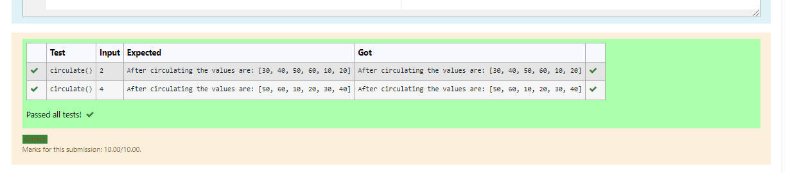

Circulate-the-values-of-N-variables
Aim:

To write a python program to circulate the n variables using function concept
Equipment’s required:
 PC
Anaconda - Python 3.7
Algorithm: 
Step 1:
Import def circulate.

Step 2:
Prepare the lists from each linear equations and assign in np.array.

Step 3:
Get the value from the user for the number of rotation.

Step 4:
Using the slicing concept rotate the list.

Step 5:
Add coding to the input value.

Step 6:
Print the coding to get answer.

Program:

#Program to circulate N values.

#Developed by: MS.Jeeva.

#RegisterNumber:21500143.

def circulate():
   l=[10,20,30,40,50,60]
   n=int(input())
   a=l[n:]+l[:n]
   print("After circulating the values are:",a)

   

## Output:

## Result:
Thus python program to circulate the n variables using function concept is obtained.
